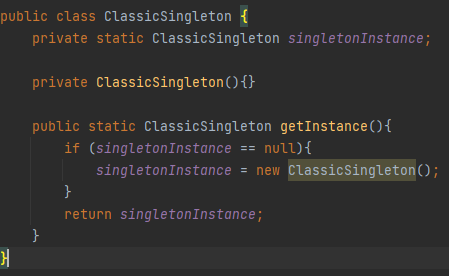
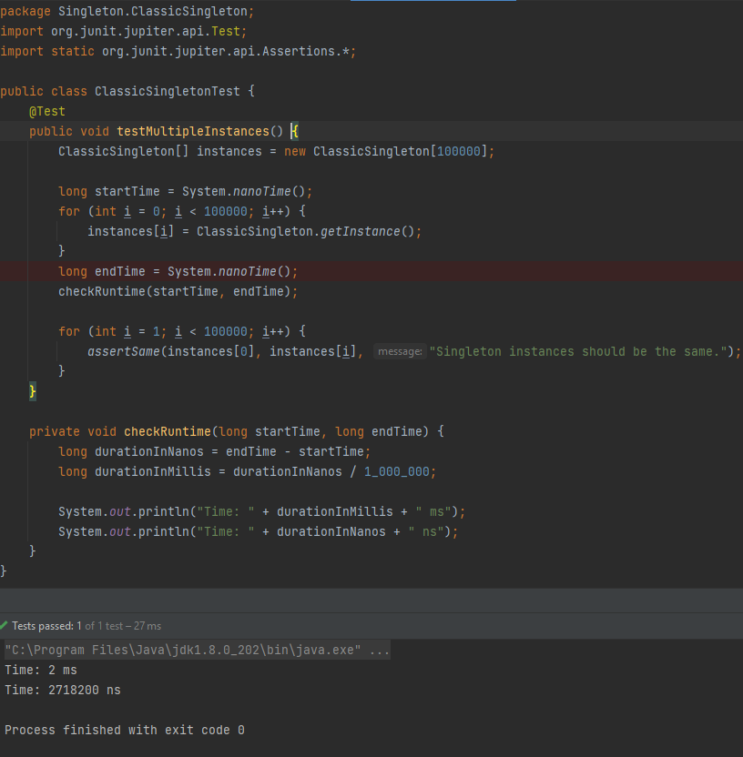
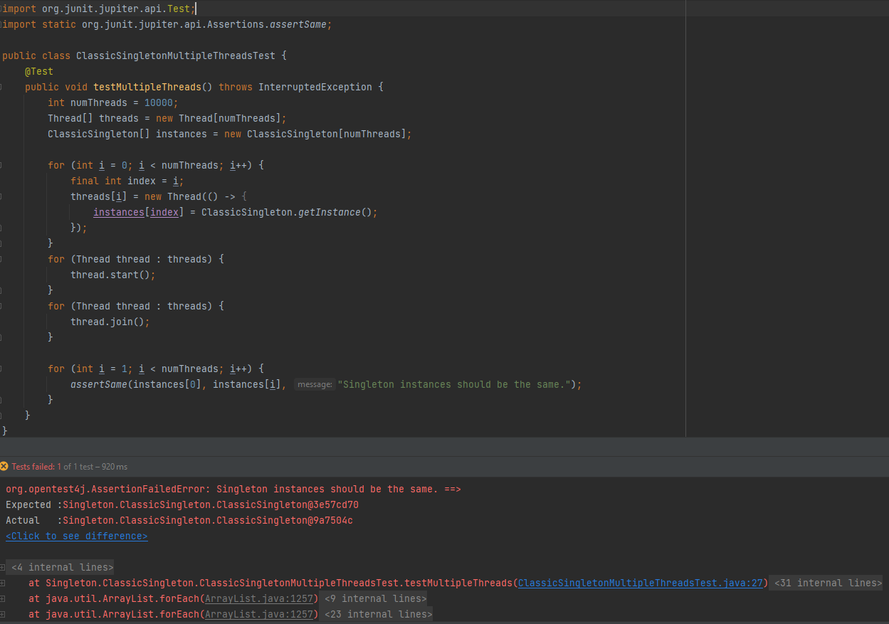
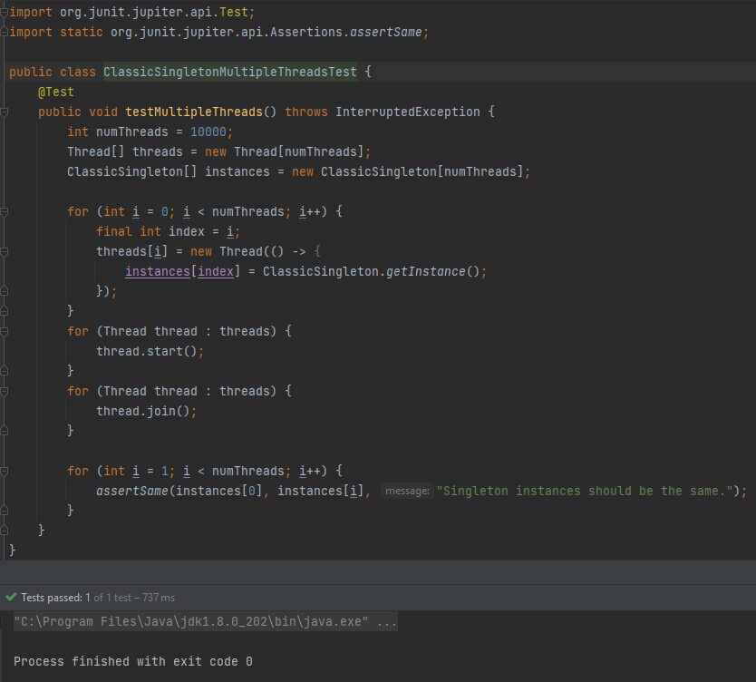
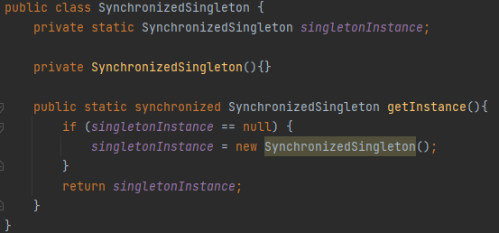
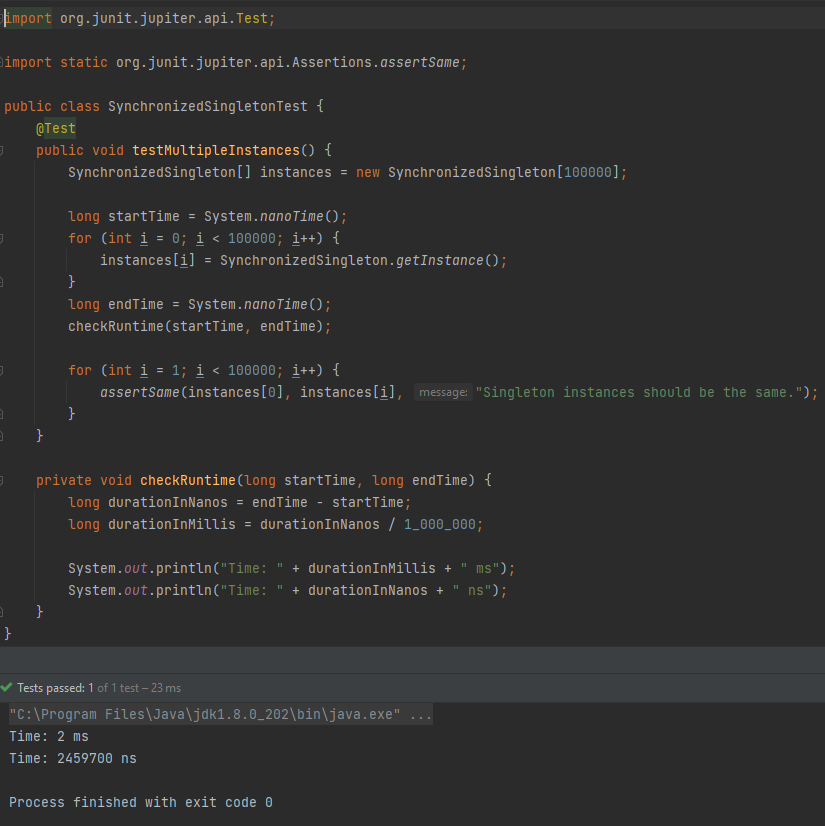
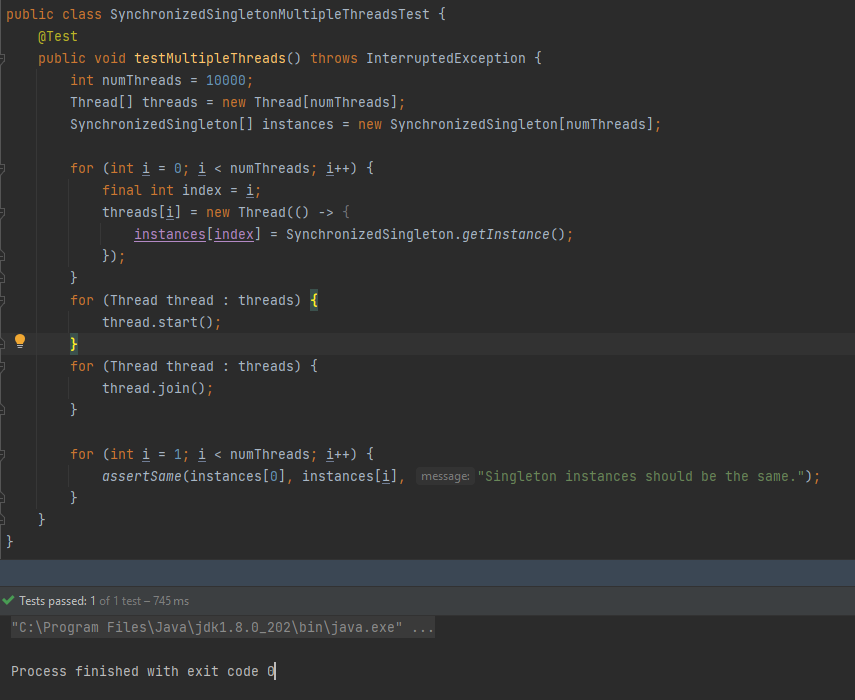
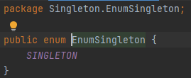
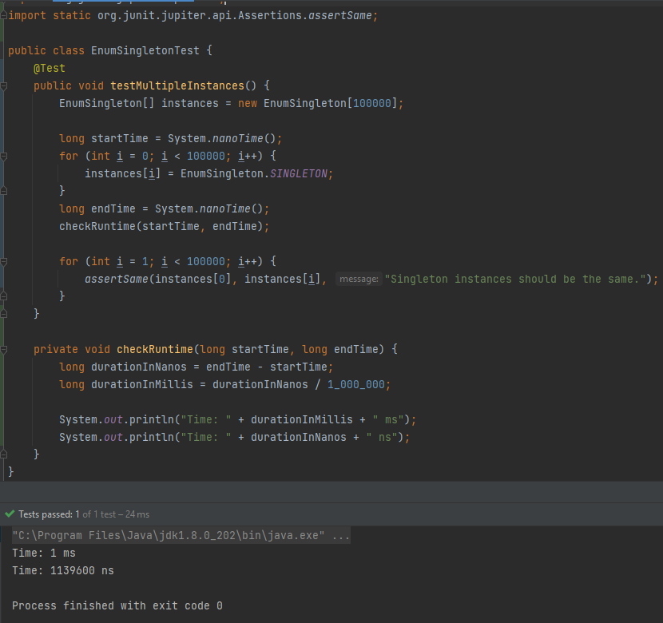

# Singleton - has everything already been told?

We all have heard about Singleton design pattern which ensures that a class will has only one instance with easy global access.
We also know that common usages are logging service, properties, global services e.g cache. Cool!

Let's try to implement it. First let's try with the most popular way - <b>private static final field</b>, <b>private constructor</b> and <b>public method</b> to create singleton.

Okay, so we finished? No, not yet.
Let's write test for our classic singleton and run it.

Cool, seems it works. Let's add another test with threads creating many singleton instances.

it failed but wait, not always (notice, I didn't change a single character):

now it's even worse - usually our test pass, but sometimes it fails. Okay, while using threads you can expect non-deterministic result, but it's really easy to fall into this pit and waste whole day to look for a bug.
Let's try to make it safer and let's synchronize our method.

Now we can run the same tests which we run for classic singleton (please notice that even times are quite similar, without synchronization it's slightly faster, but I thought it will be much faster)

and let's run test with threads on synchronized singleton:

we can run it a million times and will always pass, unlike classic singleton. The last approach which is presented in Joshua Bloch's Effective Java as the best options in most cases is single element enum class

This approach automatically handles serialization and ensures a robust defense against multiple instantiations, even in the presence of advanced serialization or reflection attacks. Keep in mind that if your Singleton needs to extend a superclass other than Enum, this approach won’t be suitable.

Let's run test for this version of singleton:

it's even much faster than classic singleton.

To summarize - sometimes it's worth to go deeper into topic to check if there is a better way to do the same.